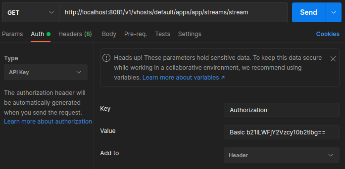

# Stream Server Analysis (S.A.S.) - Backend

Backend of [SAS](https://github.com/joaobal/stream-server-analysis).
Uses the [OvenMediaEngine](https://github.com/AirenSoft/OvenMediaEngine) to handle incoming live RTSP Feeds and relay them to users which can watch them using [SAS-Client](https://github.com/joaobal/sas-client). 

## Contents

- [SAS-Server](#stream-server-analysis-sas-backend)
  - [Contents](#contents)
  - [Description](#description)
  - [Requirements](#requirements)
  - [Installation](#installation)
  - [How to use](#how-to-use)
  - [Deploy](#deploy)
- [Development](#development)
  - [Tests](#tests)
  - [Branching](#branching)

---

## Description

SAS-Server is a media server which also processes/analyses the stream according to requests sent by the user.

## Install

1. Make sure you have at least 2.5GB available on your system

2. Make sure docker compose is installed:
```
$ docker compose version
Docker Compose version v2.15.1
```

3. Clone sas-server

4. Build with docker compose:
```
docker compose up -d --build
```

## How to use

## Deploy

---

## Development

### Debugging OvenMediaServer

Configure the message authorization according to the AccessToken in OME's server.xml config.
For example:
- OME's default API AccessToken: "ome-access-token"
- Apply base64 encoding to "ome-access-token": b21lLWFjY2Vzcy10b2tlbg==
- key to add to msg header "Basic b21lLWFjY2Vzcy10b2tlbg=="
- for ex in postman it should be:



To get all incoming streams - sent by encoder to OME:
```
http://localhost:8081/v1/vhosts/default/apps/app/streams
```

### Tests

### Branching

GitFlow:

- master: This branch always reflects a production-ready state. Only release-ready code is merged here.
- dev: This is the primary development branch where all completed features are merged. It represents the latest delivered development changes for the next release.
- feature/*: These branches are created from dev for working on new features. They are merged back into dev when the feature is complete.
- release/*: When dev has enough features for a release (or a release date is approaching), a release branch is created from dev. This branch is used for final testing, bug fixes, and preparing release metadata. Once ready, it's merged into master (and tagged) and also back into dev (to incorporate any bug fixes made in the release branch).
- hotfix/: These branches are created from master to quickly patch production issues. Once fixed, the hotfix is merged back into both master and dev (or the current release branch).

